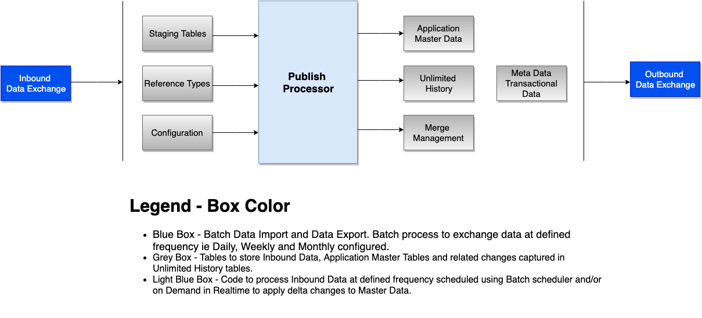
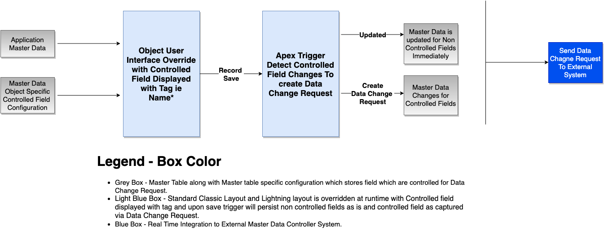

# MDM

## Scope of Project

*  **Reference Data** (Specialties, Credentials, Address Types, Phone Types, Business Type,  Professional Types)
*  **Data Exchange** Configuration and related application
*  **Transaction Data** Configuration

Applications

*  **Master Data** Publish Configuration, Subscribe Configuration and Publish
*  **Historical Data** changes to Master data using Unlimited History
*  **Merge Management** Configuration and related application
*  **Data Change Request** Configuration and related application
*  **Search and Import** Configuration and related application

## Publish Subscribe Overview

## Data Change Request

## Development Life Cycle

[Gitflow presentation](https://docs.google.com/presentation/d/1pC0jvM2OdRScSSgZXtCVeIUChTR1DagBpMrEEthVkJI/edit?usp=sharing)

* every task should be reviewed by other team members
* create branch for each task (do not commit directly to develop or master branch)
* branch name pattern: feature/{task_number}-{task_short_name}
  * task_number - gitlab task number (minimum 3 digits, e.g. 001)
  * task_short_name - short name of gitlab task e.g. staging-data-model
* always commit with short but meaningful comments + it should start with task number e.g. #1 Initial setup of continuous integration  
* after work is done and ready for review, make sure:
  * all changes are committed and continuous integration job is completed successfully
  * unit tests are in place
  * your branch is "up-to-date" with develop branch (merge from develop to your branch)
  * you created merge request from your branch to develop branch
  * you reviewed your merge request (double-check to find any bugs or unexpected changes)
  * assigned merge request to other team members for review (by default add Bartosz Osowiecki)
  * put any needed information for reviewers in merge request description including screenshots of new features
* fix all issues reported during peer review
* after merge request approval you can merge your changed to develop
